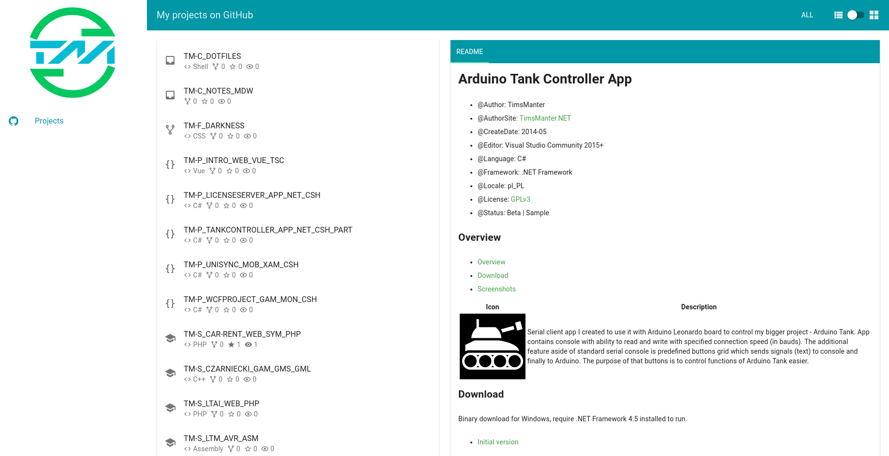
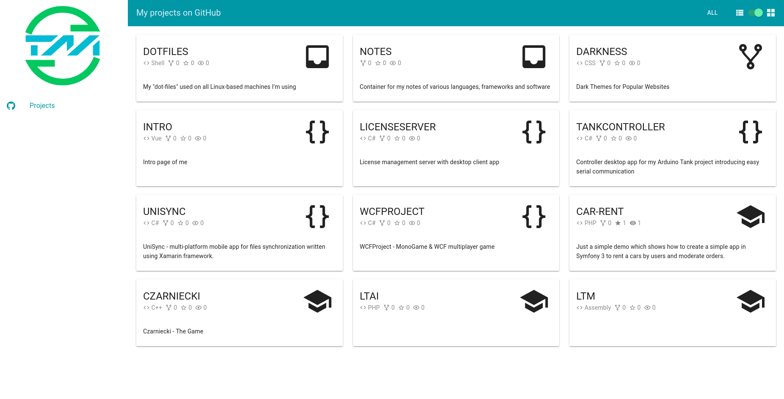
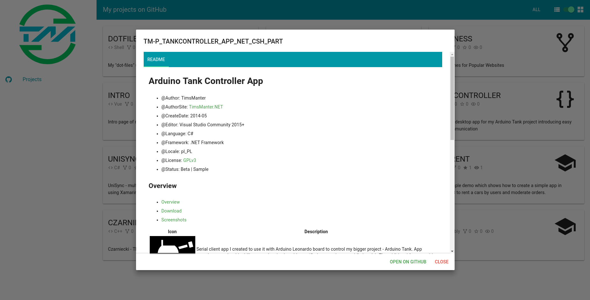

# !!!!!!!!!!!!!!!!!!!!!!!!!!!!
# Repo moved here 👉 https://github.com/SelfRef/intro
# !!!!!!!!!!!!!!!!!!!!!!!!!!!!

# Intro site with introduce of me

* @Author: TimsManter
* @AuthorSite: [TimsManter.NET](http://timsmanter.net/)
* @CreateDate: 2017-04
* @ReleaseDate: 2017-05
* @Editor: Visual Studio Code
* @Language: TypeScript
* @Framework: Vue.js
* @Locale: en_US
* @License: [GPLv3](LICENSE.md)
* @Status: Dev | Active
* @ProjectSite: [Me.TimsManter.NET](http://me.timsmanter.net)

<!-- TOC -->

- [Overview](#overview)
- [Screenshots](#screenshots)

<!-- /TOC -->

## Overview

Written using Vue.js with a taste of TypeScript bindings and Vue Class Component (Vue files). My simple intro site where I keep focus on overviewing myself. At this time only `Projects` page is available but I'm planning to add more general informations as well as move my actual blog site ([TimsManter.NET](http://timsmanter.net/)) to keep it simple.

## Screenshots

